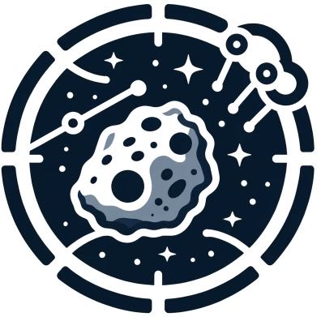

# DSAT: **D**eep **S**egmentation assisted **A**steroid **T**racking

Note: We have released  the code. We will update the readme file as soon as possible!

## Contents

    
    

        <a href="#overview"> ● Overview</a> 
        <a href="#system-environment"> ● System Environment</a> 
        <a href="#demo"> ● Demo</a> 
        <a href="#data"> ● Data</a> 
        <a href="#acknowledge"> ● Acknowledge</a> 
        <a href="#citation"> ● Citation</a>  
    

# Overview

# System Environment

# Demo

# Data

# Acknowledge

# Citation

