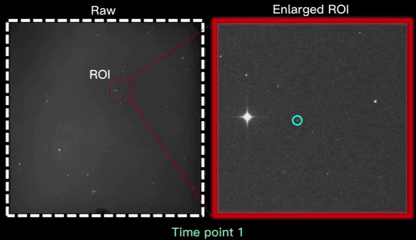

 [](https://zhenhongdu.github.io/asteroid_tracking/)  [](https://github.com/zhenhongdu/DeepSegAsteroidTracker/)   [](https://doi.org/10.1016/j.asr.2024.02.048)  


<p align="center">
<h1 align="center">DSAT: <strong>D</strong>eep <strong>S</strong>egmentation-assisted <strong>A</strong>steroid <strong>T</strong>racking</h1> </h1>
<h6 align="right">- developed by Python</h6>
</p>


## Contents


- [Overview](#overview)
- [Installation](#installation)
- [Demo](#demo)
- [Data](#results)
- [Acknowledge](#acknowledge)
- [Citation](#citation)


## Overview




DSAT aims to find faint moving asteroids using the digital imaging process method. In short, DSAT first extracts all potential faint objects with the help of deep learning-based segmentation. After that, a multi-frame tracking algorithm was developed to find real asteroids from the segmentation results. We utilize a distance tolerance criterion to help the failure detection of asteroids in complex situations. 

<br>


## Installation

We recommend using Anaconda or Miniconda to manage the package environment. You can clone this repository, then go to the folder and install the dependencies using Anaconda.

- Try a demo (w/o pytorch-gpu) --> for simulation or asteroid tracking

```python
conda env create -f environment.yml
```

- Full dependencies (w pytorch-gpu)--> for simulation, asteroid tracking, network training and inference

>Note: For GPU training, you need to install CUDA and the corresponding version of Pytorch, which you can find on this [page](https://pytorch.org/get-started/previous-versions/).

After installation, you can activate the created environment with `conda activate DSAT`.

## Usage
### Simulation
You can use the code in `0_simulation` to generate asteroids at different SNRs, speed, and field crowding conditions.

### Generate dataset
To training a segmentation network, you need to construct a paired training dataset at first.
* We randomly cropped the raw images with a size of 4096×4096 into 256 ×256 patches to prepare the training dataset. The code in `2_Segmentation_network` can be used for reference.
* The label data can be generate by ground truth (for simulation case) or manual annotation (for real data, [EISeg](https://github.com/PaddlePaddle/PaddleSeg/blob/release/2.6/EISeg/README_EN.md) is  an efficient interactive segementation tool for labeling, detailed descriptions can be found  in our [Supplementary document](https://ars.els-cdn.com/content/image/1-s2.0-S0273117724001911-mmc1.pdf)).


### Training
Users can train the segmentation network by run the script `train.py` in folder `2_Segmentation_network`  with parameter setting in `config.json`.

### Apply network
You can apply the well-trained segmentation model by run the script `apply_model.py` in folder `2_Segmentation_network`  with file path and model checkpoint.

### Test tracking
By giving raw data and segmentation results, you can test the tracking script `asteroid_tracking.py` in folder `3_Asteroid_tracer`.

## Data

The simulated training dataset and example data has been uploaded to [Zenodo: Data for DeepSegAsteroidTracker](https://zenodo.org/records/10440838).


## Acknowledge

* [EISeg](https://github.com/PaddlePaddle/PaddleSeg/blob/release/2.6/EISeg/README_EN.md)

## Citation
If you find this work useful, please consider citing us.

```
@article{DSAT2024,
title = {Deep learning-assisted near-Earth asteroid tracking in astronomical images},
journal = {Advances in Space Research},
volume = {73},
number = {10},
pages = {5349-5362},
year = {2024},
issn = {0273-1177},
doi = {https://doi.org/10.1016/j.asr.2024.02.048},
url ={https://www.sciencedirect.com/science/article/pii/S0273117724001911},
author = {Zhenhong Du and Hai Jiang and Xu Yang and Hao-Wen Cheng and Jing Liu},
keywords = {Near-Earth asteroid, Deep learning, Convolutional neural network, Faint object extraction, Moving object linking},
}
```
